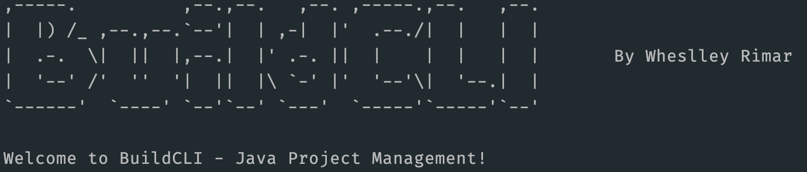

# BuildCLI

**BuildCLI** is a command-line interface (CLI) tool for managing and automating common tasks in Java project development. It allows you to create, compile, manage dependencies, and run Java projects directly from the terminal, simplifying the development process.

- **Repository:** [https://github.com/wheslleyrimar/buildcli](https://github.com/wheslleyrimar/buildcli)
- **License:** [MIT](https://opensource.org/licenses/MIT)

---

## Table of Contents

- [Features](#features)
- [Installation](#installation)
- [Usage](#usage)
- [Examples](#examples)
- [Contribution](#contribution)
- [License](#license)

---

## Features

- **Initialize Project**: Creates the basic structure of directories and files for a Java project.
- **Compile Project**: Compiles the project source code using Maven.
- **Add Dependency**: Adds new dependencies to the `pom.xml`.
- **Remove Dependency**: Remove dependencies from `pom.xml`.
- **Document Code**: [Beta] Generates documentation for a Java file using AI.
- **Manage Configuration Profiles**: Creates specific configuration files for profiles (`application-dev.properties`, `application-test.properties`, etc.).
- **Run Project**: Starts the project directly from the CLI using Spring Boot.
- **Dockerize Project**: Generates a Dockerfile for the project, allowing easy containerization.
- **Build and Run Docker Container**: Builds and runs the Docker container using the generated Dockerfile.
- **CI/CD Integration**: Automatically generates configuration files por CI/CD tools (e.g., Jenkins, Github Actions) and triggers pipelines based on project changes.

---

## Installation

1. **Clone the Repository**:
   ```bash
   git clone https://github.com/wheslleyrimar/buildcli.git
   cd buildcli
   ```

2. **Build and Package the Project**:
   ```bash
   mvn package
   ```

3. **Set up BuildCLI for Global Access**:
    - Copy the `buildcli` file to a directory in your system PATH, such as `~/bin`:
      ```bash
      cp target/buildcli ~/bin/buildcli
      chmod +x ~/bin/buildcli
      ```

Now `BuildCLI` is ready to use. Test the `buildcli` command in the terminal.

---

## Usage

Below are the main commands of `BuildCLI`. For more information about each command, you can run `buildcli --help`.

```plaintext
Usage: buildcli [OPTIONS]
Options:
  -i, --init                Initializes a new Java project
  -c, --compile             Compiles the Java project
      --add-dependency      Adds a dependency to the pom.xml in the 'groupId:artifactId' or 'groupId:artifactId:version' format
      --rm-dependency       Remove a dependency in 'groupId:artifactId' format
  -p, --profile             Creates a configuration profile (e.g., dev, test)
  -e, --set-environment     Sets the active profile for the environment (dev, test, prod) by updating `environment.config`
      --run                 Runs the Java project
  -d, --document-code       [Beta] Generates documentation for a Java file using AI (e.g., `buildcli -d <path-to-file>.java`)
  -u, --update              Check for dependency updates
      --update-now          Update dependencies to latest versions
  -t, --test                Run tests
      --dockerize           Generate a Dockerfile for the project
      --docker-build        Build and run the Docker container
      --semver              Manage semantic versioning (major, minor, patch)
      --release             Automate release by creating a Git tag and changelog
      --cicd-config         Configure CI/CD for the specified tool (e.g., github, gitlab, jenkins)
  -h, --help                Shows help
  -V, --version             Shows the version of BuildCLI
  -a, --about               Displays project information, including its purpose, repository, and contributors.
      --setup-autocomplete  Set up autocomplete for Bash, Zsh, or Fish
```

---

## Examples

### 1. Initialize a New Project
Creates the basic Java project structure, including `src/main/java`, `pom.xml`, and `README.md`.
You can specify a project name to dynamically set the package structure and project artifact.

#### Example Commands
- To initialize a project with a specific name:
```bash
buildcli --init MyProject
```
This will create the project structure with `MyProject` as the base package name, resulting in a directory like `src/main/java/org/myproject`.

- To initialize a project without specifying a name:
```bash
buildcli --init
```
This will create the project structure with `buildcli` as the base package name, resulting in a directory like `src/main/java/org/buildcli`.


### 2. Compile the Project
Compiles the Java project using Maven:
```bash
buildcli --compile
```

### 3. Add a Dependency to `pom.xml`
Adds a dependency to the project in the `groupId:artifactId` format. You can also specify a version using the format `groupId:artifactId:version`. If no version is specified, the dependency will default to the latest version available.

#### Example Commands:
- To add a dependency with the latest version:
```bash
  buildcli --add-dependency org.springframework:spring-core
```
- To add a dependency with a specified version:
```bash
  buildcli --add-dependency org.springframework:spring-core:5.3.21
```
After executing these commands, the dependency will be appended to your pom.xml file under the `<dependencies>` section.

### 4. Create a Configuration Profile
Creates a configuration file with the specified profile, for example, `application-dev.properties`:
```bash
buildcli --profile dev
```

### 5. Run the Project
Runs the Java project using Spring Boot:
```bash
buildcli --run
```

### 6. Generate Documentation for Java Code
Automatically generates inline documentation for a Java file using AI:
```bash
buildcli --document-code File.java
```
This command sends the specified Java file to the local Ollama server, which generates documentation and comments directly within the code. The modified file with documentation will be saved back to the same location.

### 7. Set Active Environment Profile
Sets the active environment profile, saving it to the `environment.config` file. The profile is referenced during project execution, ensuring that the correct configuration is loaded.
```bash
buildcli --set-environment dev
```
After running this command, the active profile is set to dev, and the `environment.config` file is updated accordingly.

#### Active Profile Display During Project Execution
With the `--set-environment` functionality, you can set the active environment profile. When running the project with `buildcli --run`, the active profile will be displayed in the terminal.

### 8. Dockerize Command
This command generates a `Dockerfile` for your Java project, making it easier to containerize your application.
```bash
buildcli --dockerize
```

### 9. Docker Build Command
This command automatically builds and runs the Docker container for you. After running the command, the Docker image will be created, and your project will run inside the container.
```bash
buildcli --docker-build
```

### 10. Set Up CI/CD Integration
Generates configuration files for CI/CD tools and prepares the project for automated pipelines. Supports Jenkins, Gitlab and Github Actions.
```bash
buildcli --cicd-config github
```

```bash
buildcli --cicd-config gitlab
```

```bash
buildcli --cicd-config jenkins
```

---

## Prerequisites

### Local Ollama API
Ensure you have the Ollama server running locally, as the `--document-code` functionality relies on an AI model accessible via a local API.
- [Download Ollama](https://ollama.com/download)

You can start the Ollama server by running:

```bash
ollama run llama3.2
```

### Prerequisites for CI/CD Integration
- **Jenkins**: Ensure Jenkins is installed and accessible in your environment.
- **GitHub Actions**: Ensure your repository is hosted on GitHub with Actions enabled.

---

## Contribution

Contributions are welcome! Feel free to open **Issues** and submit **Pull Requests**.

To contribute:
1. Fork the project.
2. Create a branch for your changes:
   ```bash
   git checkout -b feature/my-feature
   ```
3. Commit your changes:
   ```bash
   git commit -m "My new feature"
   ```
4. Push to your branch:
   ```bash
   git push origin feature/my-feature
   ```
5. Open a Pull Request in the main repository.

---

## License

This project is licensed under the MIT License - see the [LICENSE](LICENSE) file for details.
